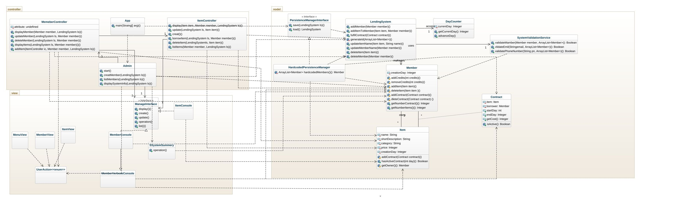
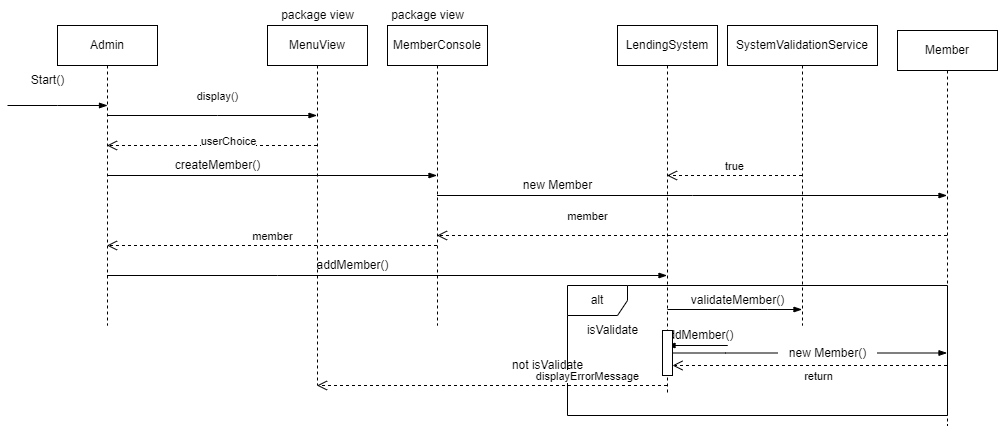
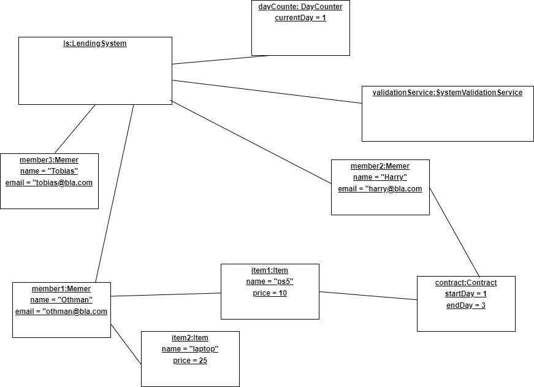

# Lendingsystem OO-Design
This document describes the design according to the requirements presented in assignment 2.

The application uses MVC pattern. The view may only read data, and can not affect the state of the system. 

### Class Diagram
The class diagram focus on showing the relationships between the classes.
[Class Diagram link](img/class_diagram.jpeg)

### Sequence Diagram

Note: The member is first created in the view, but this is object is not trusted, it's only used to transfer name, email, phone number to the lending system. The lending system will create a new member, to make sure that currentDay is correct and that only the name, email and phone is used from the view. The sequence diagram focus on showing a scenario in the system.

[Sequence Diagram link](img/sequence_diagram.png)

### Object Diagram

Note: We have chosen to show the moment in time after the third member was added succesfully in the sequence diagram above. There are 2 items and 1 contract in the system, and the current day is 1. The object diagram is a specific snapshot in time of the system.

[Object Diagram link](img/object_diagram.png)

